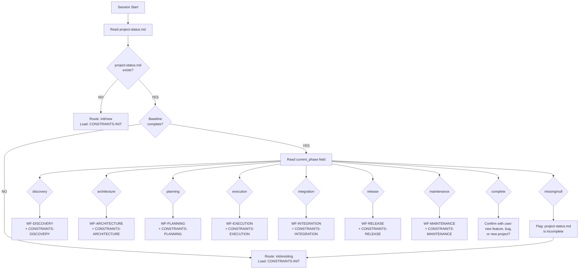
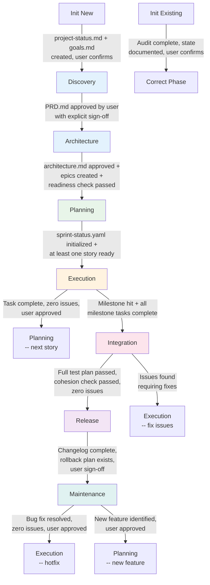
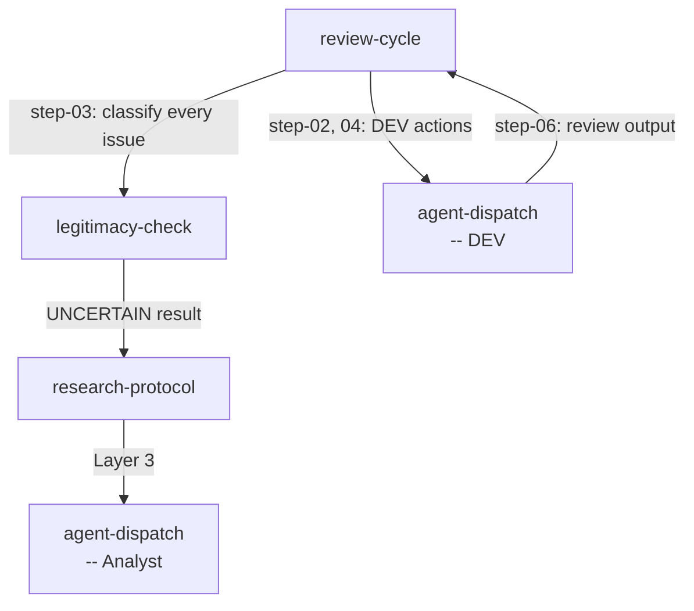
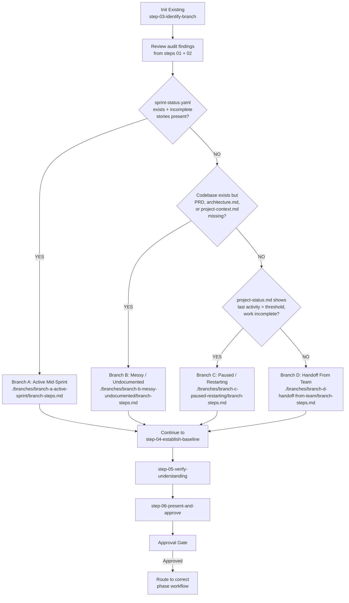

# Parzival Routing Map

> **Authority**: Specification document for Parzival workflow routing logic
> **Source**: `_ai-memory/pov/workflows/WORKFLOW-MAP.md` and all workflow.md files
> **Version**: POV Module v2.1.0
> **Generated**: 2026-03-19

---

## 1. Master Routing Flowchart

The complete decision tree that Parzival follows at every session start to determine which workflow to load.



### Routing Error Handling

When routing is ambiguous:

| Condition | Action |
|-----------|--------|
| Cannot read project-status.md | Alert user, ask if new or existing project |
| current_phase is invalid/missing | Run Analyst audit, verify before routing |
| Conflicting signals (e.g., PRD exists but phase says "discovery") | Report conflict to user, confirm before proceeding |

Rule: When routing is ambiguous, stop, report, ask. Never guess the route.

---

## 2. Per-Workflow Route Cards

### Session Workflows

---

#### Session Start (ST)

- **Trigger**: User selects [ST] from menu or activates Parzival with full session start
- **Constraints loaded**: Global only (no phase-specific)
- **Context slice**: project-status.md, SESSION_WORK_INDEX.md, task-tracker.md, blockers-log.md, risk-register.md, most recent SESSION_HANDOFF_*.md
- **Step chain**: step-01-load-context -> step-01b-parzival-bootstrap -> step-01c-parzival-constraints -> step-02-compile-status -> step-03-present-and-wait
- **Cycles called**: None
- **Exit condition**: User provides direction
- **Exit route**: Returns to menu; user selects next action

---

#### Quick Status (SU)

- **Trigger**: User selects [SU] from menu
- **Constraints loaded**: Global only
- **Context slice**: SESSION_WORK_INDEX.md, task-tracker.md, blockers-log.md, risk-register.md
- **Step chain**: Single-step inline workflow (no step files)
- **Cycles called**: None
- **Exit condition**: Status presented to user
- **Exit route**: Returns to menu

---

#### Blocker Analysis (BL)

- **Trigger**: User selects [BL] from menu or blocker encountered during workflow
- **Constraints loaded**: Global + active phase constraints
- **Context slice**: blockers-log.md, relevant project files for the blocked item
- **Step chain**: step-01-capture-blocker -> step-02-analyze-and-resolve -> step-03-log-blocker
- **Cycles called**: research-protocol (if root cause is unclear)
- **Exit condition**: Blocker logged with chosen resolution
- **Exit route**: Returns to prior workflow or menu

---

#### Decision Support (DC)

- **Trigger**: User selects [DC] from menu or decision point reached during workflow
- **Constraints loaded**: Global + active phase constraints
- **Context slice**: Relevant project files for the decision context
- **Step chain**: step-01-structure-decision -> step-02-present-decision -> step-03-log-decision
- **Cycles called**: approval-gate (step-02 uses approval gate format)
- **Exit condition**: User makes explicit choice, outcome logged
- **Exit route**: Returns to prior workflow or menu

---

#### Verification (VE)

- **Trigger**: User selects [VE] from menu
- **Constraints loaded**: Global + active phase constraints
- **Context slice**: Depends on verification type (story file, code files, or deployment artifacts)
- **Step chain**: step-01-determine-type -> step-02-load-checklist -> step-03-execute-checks -> step-04-report-results
- **Cycles called**: None
- **Exit condition**: Verification report presented with PASS/FAIL/UNCERTAIN per check
- **Exit route**: Returns to menu

---

#### Handoff (HO)

- **Trigger**: User selects [HO] from menu, before risky operations, or at progress milestones
- **Constraints loaded**: Global + active phase constraints
- **Context slice**: Current session state, active work, open questions
- **Step chain**: step-01-capture-state -> step-02-write-handoff -> step-03-update-index
- **Cycles called**: None
- **Exit condition**: Handoff document written and indexed in SESSION_WORK_INDEX
- **Exit route**: Session continues (does not end)

---

#### Session Close (CL)

- **Trigger**: User selects [CL] from menu or session needs to end
- **Constraints loaded**: Global + active phase constraints
- **Context slice**: All tracking files, all session work, active agents
- **Step chain**: step-01-summarize-session -> step-02-update-tracking -> step-03-create-handoff -> step-04-save-and-confirm
- **Cycles called**: None
- **Exit condition**: All tracking files updated, handoff created, Qdrant save attempted (graceful degradation), user confirms
- **Exit route**: Session ends. Parzival stands down.

---

### Init Workflows

---

#### Init New

- **Trigger**: project-status.md does not exist
- **Constraints loaded**: Global + Init (IN-01 through IN-05)
- **Context slice**: None (file creation is the first task)
- **Step chain**: step-01-gather-project-info -> step-02-validate-and-clarify -> step-03-verify-installation -> step-04-create-baseline-files -> step-05-establish-teams -> step-06-verify-baseline -> step-07-present-and-approve
- **Cycles called**: approval-gate (step-07)
- **Exit condition**: project-status.md + goals.md created, baseline verified, user approves via approval gate
- **Exit route**: WF-DISCOVERY

---

#### Init Existing

- **Trigger**: project-status.md exists but baseline is incomplete, OR project exists with no project-status.md
- **Constraints loaded**: Global + Init (IN-01 through IN-05)
- **Context slice**: project-status.md + any existing docs
- **Step chain**: step-01-read-existing-files -> step-02-run-analyst-audit -> step-03-identify-branch -> [branch-specific steps] -> step-04-establish-baseline -> step-05-verify-understanding -> step-06-present-and-approve
- **Cycles called**: agent-dispatch (step-02, Analyst audit), approval-gate (step-06)
- **Exit condition**: Audit complete, current state documented, user confirms via approval gate
- **Exit route**: Correct phase workflow based on audit findings

---

### Phase Workflows

---

#### Discovery (Phase 1)

- **Trigger**: Phase 1 after init baseline established, no approved PRD yet
- **Constraints loaded**: Global + Discovery (DC-01 through DC-07)
- **Context slice**: goals.md + PRD draft (if exists)
- **Step chain**: step-01-assess-existing-inputs -> step-02-analyst-research -> step-03-pm-creates-prd -> step-04-parzival-reviews-prd -> step-05-user-review-iteration -> step-06-prd-finalization -> step-07-approval-gate
- **Cycles called**: agent-dispatch (steps 02, 03), approval-gate (step-07), research-protocol (if input is thin)
- **Exit condition**: PRD.md approved by user with explicit sign-off
- **Exit route**: WF-ARCHITECTURE

---

#### Architecture (Phase 2)

- **Trigger**: PRD approved, no architecture.md yet
- **Constraints loaded**: Global + Architecture (AC-01 through AC-08)
- **Context slice**: PRD.md + architecture.md
- **Step chain**: step-01-assess-inputs -> step-02-architect-designs -> step-03-ux-design -> step-04-parzival-reviews-architecture -> step-05-user-review-iteration -> step-06-pm-creates-epics-stories -> step-07-readiness-check -> step-08-finalize -> step-09-approval-gate
- **Cycles called**: agent-dispatch (steps 02, 03, 06, 07), approval-gate (step-09), research-protocol (as needed)
- **Exit condition**: architecture.md approved + epics created + readiness check passed
- **Exit route**: WF-PLANNING

---

#### Planning (Phase 3)

- **Trigger**: Architecture approved, sprint needs initialization or refresh
- **Constraints loaded**: Global + Planning (PC-01 through PC-08)
- **Context slice**: architecture.md + backlog/epics
- **Step chain**: step-01-review-project-state -> step-02-retrospective -> step-03-sm-sprint-planning -> step-04-sm-creates-story-files -> step-05-parzival-reviews-sprint -> step-06-user-review-approval -> step-07-approval-gate
- **Cycles called**: agent-dispatch (steps 03, 04), approval-gate (step-07)
- **Exit condition**: sprint-status.yaml initialized + at least one story file ready
- **Exit route**: WF-EXECUTION (first task of sprint)

---

#### Execution (Phase 4)

- **Trigger**: Task assigned from sprint
- **Constraints loaded**: Global + Execution (EC-01 through EC-09)
- **Context slice**: current-task.md + standards.md + project-context.md
- **Step chain**: step-01-verify-story-requirements -> step-02-prepare-instruction -> step-03-activate-dev -> step-04-review-cycle -> step-05-verify-fixes -> step-06-prepare-summary -> step-07-approval-gate
- **Cycles called**: agent-dispatch (step-03), review-cycle (step-04), legitimacy-check (within review-cycle), approval-gate (step-07)
- **Exit condition**: Zero legitimate issues, user approves
- **Exit route**: WF-PLANNING (next story) or WF-INTEGRATION (milestone hit)

---

#### Integration (Phase 5)

- **Trigger**: Milestone hit, feature set complete
- **Constraints loaded**: Global + Integration (IC-01 through IC-07)
- **Context slice**: Feature spec + test plan
- **Step chain**: step-01-establish-scope -> step-02-prepare-test-plan -> step-03-dev-full-review -> step-04-architect-cohesion -> step-05-review-findings -> step-06-fix-cycle -> step-07-final-verification -> step-08-approval-gate
- **Cycles called**: agent-dispatch (steps 03, 04, 06), review-cycle (step-06), legitimacy-check (step-05), approval-gate (step-08)
- **Exit condition**: Full test plan passed, cohesion check passed, zero issues
- **Exit route**: WF-RELEASE (if integration passes) or WF-EXECUTION (if issues found)

---

#### Release (Phase 6)

- **Trigger**: Integration approved, ready to ship
- **Constraints loaded**: Global + Release (RC-01 through RC-07)
- **Context slice**: Release checklist + changelog
- **Step chain**: step-01-compile-release -> step-02-create-changelog -> step-03-deployment-checklist -> step-04-rollback-plan -> step-05-dev-deployment-verification -> step-06-parzival-reviews-artifacts -> step-07-approval-gate
- **Cycles called**: agent-dispatch (steps 02, 05), approval-gate (step-07)
- **Exit condition**: Changelog complete, rollback plan exists, user sign-off complete
- **Exit route**: WF-MAINTENANCE or WF-PLANNING

---

#### Maintenance (Phase 7)

- **Trigger**: Post-release bug report or improvement request
- **Constraints loaded**: Global + Maintenance (MC-01 through MC-08)
- **Context slice**: Issue report + relevant module
- **Step chain**: step-01-triage-issue -> step-02-classify-issue -> step-03-analyst-diagnosis -> step-04-create-maintenance-task -> step-05-dev-implements-fix -> step-06-review-cycle -> step-07-approval-gate
- **Cycles called**: agent-dispatch (steps 03, 05), review-cycle (step-06), legitimacy-check (within review-cycle), approval-gate (step-07)
- **Exit condition**: Issue resolved to zero legitimate issues, user approved
- **Exit route**: WF-PLANNING (if improvement/new feature) or WF-EXECUTION (if bug fix) or remains in Maintenance (next issue in queue)

---

### Cycle Workflows

---

#### Agent Dispatch

- **Trigger**: Any workflow step that requires agent activation
- **Constraints loaded**: Inherits from calling workflow
- **Context slice**: Instruction template, agent selection criteria, task requirements
- **Step chain**: step-01-prepare-instruction -> step-02-create-team -> step-03-activate-agent -> step-04-send-instruction -> step-05-monitor-progress -> step-06-receive-output -> step-07-accept-or-loop -> step-08-shutdown-teammate -> step-09-prepare-summary
- **Cycles called**: review-cycle (from step-06 if code review needed)
- **Exit condition**: Agent output accepted and summarized, teammate shut down
- **Exit route**: Returns to calling workflow step

---

#### Approval Gate

- **Trigger**: Every phase exit, every task completion, decision points
- **Constraints loaded**: Inherits from calling workflow
- **Context slice**: Work summary, review stats, recommendation
- **Step chain**: step-01-prepare-package -> step-02-present-to-user -> step-03-process-response -> step-04-record-outcome
- **Cycles called**: None
- **Exit condition**: User provides explicit response (Approve, Reject, or Hold)
- **Exit route**: Approve -> next workflow per calling context. Reject -> returns to calling workflow with feedback. Hold -> pauses.

---

#### Legitimacy Check

- **Trigger**: Every issue surfaced during review, audit, or maintenance
- **Constraints loaded**: Inherits from calling workflow
- **Context slice**: Issue details, project files (PRD, architecture, standards)
- **Step chain**: step-01-read-issue -> step-02-check-project-files -> step-03-classify-issue -> step-04-record-classification -> step-05-assign-priority
- **Cycles called**: research-protocol (if classification is UNCERTAIN)
- **Exit condition**: Issue classified as LEGITIMATE (with priority), NON-ISSUE, or UNCERTAIN resolved
- **Exit route**: Returns to calling workflow (review-cycle or maintenance)

---

#### Research Protocol

- **Trigger**: Uncertainty in any workflow, UNCERTAIN legitimacy check result, failed fix
- **Constraints loaded**: Inherits from calling workflow
- **Context slice**: Research question, project files, documentation sources
- **Step chain**: step-01-define-question -> step-02-layer1-project-files -> step-03-layer2-documentation -> step-04-layer3-analyst-research -> step-05-escalate-to-user -> step-06-document-answer
- **Cycles called**: agent-dispatch (step-04, Analyst agent)
- **Exit condition**: Verified, sourced answer documented, or user provides answer
- **Exit route**: Returns to calling workflow with answer

---

#### Review Cycle

- **Trigger**: Implementation output needs verification (Execution, Integration)
- **Constraints loaded**: Inherits from calling workflow
- **Context slice**: Implementation output, story requirements, standards
- **Step chain**: step-01-verify-completeness -> step-02-trigger-code-review -> step-03-process-review-report -> step-04-build-correction-instruction -> step-05-receive-fixes -> (loop to step-03) ... -> step-07-exit-cycle
- **Cycles called**: legitimacy-check (step-03, for every issue), agent-dispatch (steps 02, 04 for DEV corrections)
- **Exit condition**: Review pass returns zero legitimate issues
- **Exit route**: Returns to calling workflow (typically to approval-gate)

Note: step-06-cycle-tracking is a reference step (type: reference), not part of the main chain. step-05 loops back to step-03 for re-review after fixes.

---

## 3. Phase Transition Diagram



### Phase Exit Conditions (Complete Reference)

| From | To | Exit Condition |
|------|------|---------------|
| Init New | Discovery | project-status.md + goals.md created, user confirms |
| Init Existing | Correct phase | Audit complete, current state documented, user confirms |
| Discovery | Architecture | PRD.md approved by user with explicit sign-off |
| Architecture | Planning | architecture.md approved + epics created + readiness check passed |
| Planning | Execution | sprint-status.yaml initialized + at least one story file ready |
| Execution | Planning | Task complete, zero legitimate issues, user approved |
| Execution | Integration | Milestone hit + all milestone tasks complete to zero issues |
| Integration | Release | Full test plan passed, cohesion check passed, zero issues |
| Integration | Execution | Issues found requiring fixes |
| Release | Maintenance | Changelog complete, rollback plan exists, user sign-off complete |
| Maintenance | Planning | New feature request identified |
| Maintenance | Execution | Bug fix or hotfix needed |

Rule: If an exit condition is not met, the phase does not advance. No exceptions.

---

## 4. Cycle Invocation Map

Which workflows invoke which cycles:

| Cycle | Invoked By | Context |
|-------|-----------|---------|
| agent-dispatch | Discovery (steps 02, 03), Architecture (steps 02, 03, 06, 07), Planning (steps 03, 04), Execution (step 03), Integration (steps 03, 04, 06), Release (steps 02, 05), Maintenance (steps 03, 05), Init Existing (step 02) | Every agent activation |
| approval-gate | Init New (step 07), Init Existing (step 06), Discovery (step 07), Architecture (step 09), Planning (step 07), Execution (step 07), Integration (step 08), Release (step 07), Maintenance (step 07), Decision support (step 02) | Every phase exit + task completion |
| legitimacy-check | Review Cycle (step 03), Maintenance (step 02), Integration (step 05) | Every issue surfaced during review |
| research-protocol | Any phase when uncertainty arises, Legitimacy Check (when UNCERTAIN), Blocker Analysis (if root cause unclear) | Whenever confidence drops below INFORMED |
| review-cycle | Execution (step 04), Integration (step 06), Maintenance (step 06) | Every implementation output |

### Cycle Nesting

Cycles can invoke other cycles:



Maximum nesting depth in practice: review-cycle -> legitimacy-check -> research-protocol -> agent-dispatch (4 levels).

---

## 5. Init Existing Branch Routing



### Branch Details

| Branch | Signal | Action | Caution | Likely Exit Route |
|--------|--------|--------|---------|-------------------|
| A: Active Mid-Sprint | sprint-status.yaml exists + incomplete stories | Read sprint state, identify active task | Do not disrupt in-progress work | Execution |
| B: Messy/Undocumented | Codebase exists but key docs missing | Activate Analyst to audit and document | Cannot assume undocumented behavior is intentional | Discovery or Architecture |
| C: Paused/Restarting | Last activity > threshold, work incomplete | Review last known state, confirm with user | Verify nothing changed externally since pause | Planning or Execution |
| D: Handoff From Team | Docs exist but Parzival has no prior context | Full audit of all available docs | Never assume prior documentation is accurate | Varies by audit findings |

---

## 6. Session Start Sequence

The complete load sequence at every session start, sourced from WORKFLOW-MAP.md:

```
1. parzival.md              -> identity and constraints active
2. constraints/global/constraints.md -> GC-01 through GC-20 active
3. workflows/WORKFLOW-MAP.md         -> determine routing
4. project-status.md        -> read current project state
5. [phase workflow]          -> load correct workflow file
6. [phase constraints]       -> load correct constraint file
7. [context slice]           -> load only the files needed for this phase
8. Confirm state to user     -> ready to work
```

---

## 7. End of Session Protocol

Before every session ends, Parzival must:

1. Update project-status.md: current_phase, active_task, last_session_summary, open_issues, notes
2. Confirm with user: what was completed, what is in progress, what the next session should start with
3. Shut down all active agent teammates via shutdown_request

---

## 8. Menu Command Routing Reference

| Code | Label | Route |
|------|-------|-------|
| HP | Help | `_ai-memory/core/tasks/help.md` |
| CH | Chat | Inline (no workflow file) |
| ST | Session Start | `workflows/session/start/workflow.md` |
| SU | Quick Status | `workflows/session/status/workflow.md` |
| BL | Blocker Analysis | `workflows/session/blocker/workflow.md` |
| DC | Decision Support | `workflows/session/decision/workflow.md` |
| VE | Verification | `workflows/session/verify/workflow.md` |
| CR | Code Review | `_ai-memory/agents/code-reviewer.md` |
| BR | Best Practices | `.claude/skills/aim-best-practices-researcher/SKILL.md` |
| FR | Freshness Report | `.claude/skills/aim-freshness-report/SKILL.md` |
| TP | Team Builder | `.claude/skills/aim-parzival-team-builder/SKILL.md` |
| HO | Handoff | `workflows/session/handoff/workflow.md` |
| CL | Session Close | `workflows/session/close/workflow.md` |
| DA | Dispatch Agent | `workflows/cycles/agent-dispatch/workflow.md` |
| EX | Exit | Dismiss Parzival (no workflow file) |
