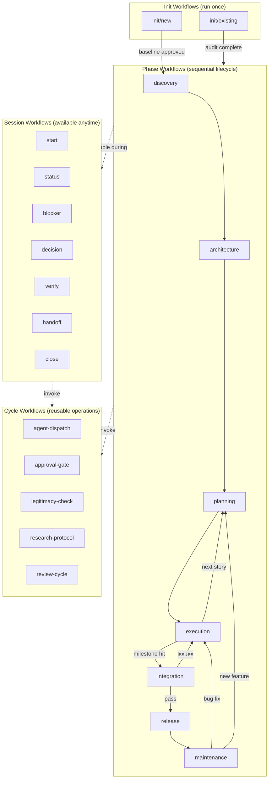
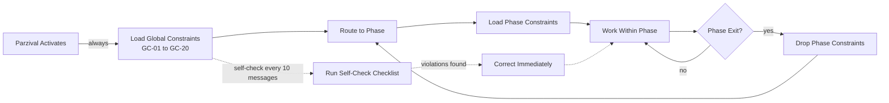
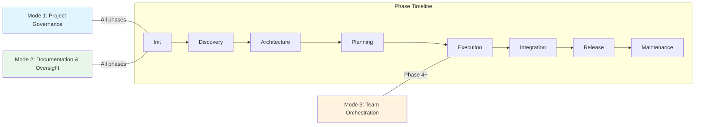
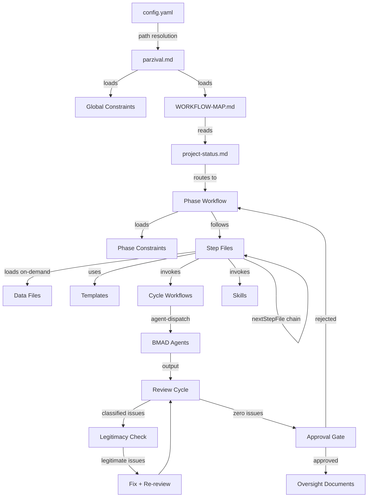

# Parzival System Architecture

> **Authority**: Specification document for the Parzival Oversight (POV) module structure
> **Source**: `_ai-memory/pov/` directory in the ai-memory repository
> **Version**: POV Module v2.1.0 (config.yaml date: 2026-03-14)
> **Generated**: 2026-03-19

---

## 1. Directory Map

```
_ai-memory/pov/
|-- agents/
|   +-- parzival.md                    # Agent definition: identity, persona, rules, menu, behaviors
|
|-- config.yaml                        # Module configuration: paths, user_name, language, teams_enabled
|
|-- constraints/                       # Behavioral constraint system (9 directories)
|   |-- global/                        # Always active (17 constraint files + constraints.md index)
|   |   |-- constraints.md             # GC-01 through GC-20 summary and self-check schedule
|   |   |-- GC-01-never-implement.md
|   |   |-- GC-02-never-guess.md
|   |   |-- GC-03-check-project-files.md
|   |   |-- GC-04-user-manages-parzival.md
|   |   |-- GC-05-verify-fixes.md
|   |   |-- GC-06-distinguish-issues.md
|   |   |-- GC-07-never-pass-known-issues.md
|   |   |-- GC-08-never-carry-debt.md
|   |   |-- GC-09-review-agent-output.md
|   |   |-- GC-10-present-summaries.md
|   |   |-- GC-11-precise-instructions.md
|   |   |-- GC-12-loop-until-zero.md
|   |   |-- GC-13-best-practices-research.md
|   |   |-- GC-14-similar-issue-detection.md
|   |   |-- GC-15-template-usage.md
|   |   |-- GC-19-spawn-agents-as-teammates.md
|   |   +-- GC-20-no-instruction-in-activation.md
|   |-- init/                          # Active during init workflows (5 constraints: IN-01 to IN-05)
|   |-- discovery/                     # Active during Discovery phase (7 constraints: DC-01 to DC-07)
|   |-- architecture/                  # Active during Architecture phase (8 constraints: AC-01 to AC-08)
|   |-- planning/                      # Active during Planning phase (8 constraints: PC-01 to PC-08)
|   |-- execution/                     # Active during Execution phase (8 constraints: EC-01 to EC-09)
|   |-- integration/                   # Active during Integration phase (7 constraints: IC-01 to IC-07)
|   |-- release/                       # Active during Release phase (7 constraints: RC-01 to RC-07)
|   +-- maintenance/                   # Active during Maintenance phase (8 constraints: MC-01 to MC-08)
|
|-- data/                              # Reference data files loaded on-demand by steps
|   |-- complexity-assessment.md       # Complexity level definitions (Straightforward/Moderate/Significant/Complex)
|   |-- confidence-levels.md           # Confidence level definitions (Verified/Informed/Inferred/Uncertain/Unknown)
|   |-- document-maintenance.md        # Document update and maintenance rules
|   |-- escalation-protocol.md         # Escalation severity levels (Critical/High/Medium/Low)
|   |-- issue-classification-criteria.md  # Legitimate vs. non-issue classification criteria
|   |-- parzival-master-plan.md        # Original system design document
|   +-- self-check-constraints.md      # Self-check checklist definitions
|
|-- skills/                            # Dispatch pipeline skills (7 directories)
|   |-- aim-agent-dispatch/            # Single-agent dispatch with instruction template
|   |-- aim-agent-lifecycle/           # Agent monitoring, review, correction loop, shutdown
|   |-- aim-bmad-dispatch/             # BMAD-specific agent activation (menu -> workflow -> instruction)
|   |-- aim-model-dispatch/            # Model selection (Sonnet default, Opus for architecture/escalation)
|   |-- aim-parzival-bootstrap/        # Cross-session memory retrieval from Qdrant (SKILL.md)
|   |-- aim-parzival-constraints/      # Behavioral constraint loading (SKILL.md)
|   +-- aim-parzival-team-builder/     # Multi-agent team design and spawn orchestration (SKILL.md + templates/)
|
|-- templates/                         # Document templates for oversight artifacts
|   |-- bug-report.template.md         # Bug report format
|   |-- correction.template.md         # Agent correction instruction format
|   |-- decision-log.template.md       # Decision record format
|   |-- session-handoff.template.md    # Session handoff document format
|   |-- verification-code.template.md  # Code verification checklist
|   |-- verification-production.template.md  # Production readiness checklist
|   +-- verification-story.template.md # Story completion checklist
|
+-- workflows/                         # All workflow definitions (4 categories, 21 workflows)
    |-- WORKFLOW-MAP.md                # Master routing engine (loaded at every session start)
    |-- init/                          # One-time project onboarding workflows
    |   |-- new/                       # New project initialization (7 steps)
    |   |   |-- workflow.md
    |   |   +-- steps/                 # step-01 through step-07
    |   +-- existing/                  # Existing project onboarding (6 steps + 4 branches)
    |       |-- workflow.md
    |       |-- steps/                 # step-01 through step-06
    |       +-- branches/              # 4 branch-specific step files
    |           |-- branch-a-active-sprint/branch-steps.md
    |           |-- branch-b-messy-undocumented/branch-steps.md
    |           |-- branch-c-paused-restarting/branch-steps.md
    |           +-- branch-d-handoff-from-team/branch-steps.md
    |-- session/                       # Session lifecycle workflows (available anytime from menu)
    |   |-- start/                     # Session start (5 steps: 01, 01b, 01c, 02, 03)
    |   |-- status/                    # Quick status (single-step, inline)
    |   |-- blocker/                   # Blocker analysis (3 steps)
    |   |-- decision/                  # Decision support (3 steps)
    |   |-- verify/                    # Verification protocol (4 steps)
    |   |-- handoff/                   # Mid-session handoff (3 steps)
    |   +-- close/                     # Session closeout (4 steps)
    |-- phases/                        # Sequential project lifecycle workflows
    |   |-- discovery/                 # Phase 1: PRD creation (7 steps)
    |   |-- architecture/              # Phase 2: Technical blueprint (9 steps)
    |   |-- planning/                  # Phase 3: Sprint planning (7 steps)
    |   |-- execution/                 # Phase 4: Story implementation (7 steps)
    |   |-- integration/               # Phase 5: Quality gate (8 steps)
    |   |-- release/                   # Phase 6: Ship preparation (7 steps)
    |   +-- maintenance/               # Phase 7: Post-release fixes (7 steps)
    +-- cycles/                        # Reusable atomic operations called from other workflows
        |-- agent-dispatch/            # Agent lifecycle management (9 steps)
        |-- approval-gate/             # User approval protocol (4 steps)
        |-- legitimacy-check/          # Issue triage and classification (5 steps)
        |-- research-protocol/         # Verified research process (6 steps)
        +-- review-cycle/              # Dev-review loop (7 steps)
```

---

## 2. Workflow Categories

21 workflows organized into 4 categories:

### Session Workflows (7)

Available anytime from Parzival's menu. Manage session lifecycle.

| Workflow | Menu Code | Steps | Purpose |
|----------|-----------|-------|---------|
| start | ST | 5 (01, 01b, 01c, 02, 03) | Load context, compile status, present to user |
| status | SU | 1 (inline) | Read-only status snapshot |
| blocker | BL | 3 | Capture, analyze, and log blockers |
| decision | DC | 3 | Structure decisions with options and tradeoffs |
| verify | VE | 4 | Run verification protocol (story/code/production) |
| handoff | HO | 3 | Mid-session state snapshot |
| close | CL | 4 | Full session closeout with tracking updates |

### Init Workflows (2)

One-time project onboarding. Run once per project.

| Workflow | Steps | Purpose |
|----------|-------|---------|
| init/new | 7 | New project from scratch. Establish baseline. |
| init/existing | 6 + 4 branches | Existing project onboarding. Audit, classify, baseline. |

### Phase Workflows (7)

Sequential project lifecycle. Each loads its own phase-specific constraints.

| Workflow | Phase | Steps | Agents Used | Exit To |
|----------|-------|-------|-------------|---------|
| discovery | 1 | 7 | Analyst, PM | architecture |
| architecture | 2 | 9 | Architect, PM, UX Designer (optional) | planning |
| planning | 3 | 7 | SM | execution |
| execution | 4 | 7 | DEV (implement + review) | planning or integration |
| integration | 5 | 8 | DEV, Architect | release or execution |
| release | 6 | 7 | SM, DEV | maintenance or planning |
| maintenance | 7 | 7 | Analyst, DEV | planning or execution |

### Cycle Workflows (5)

Reusable atomic operations invoked from within other workflows.

| Workflow | Steps | Purpose |
|----------|-------|---------|
| agent-dispatch | 9 | Agent activation, instruction, monitoring, shutdown |
| approval-gate | 4 | User approval protocol (Approve/Reject/Hold) |
| legitimacy-check | 5 | Issue triage: LEGITIMATE / NON-ISSUE / UNCERTAIN |
| research-protocol | 6 | Three-layer verified research process |
| review-cycle | 7 | Dev-review loop until zero legitimate issues |

### Workflow Category Relationships



---

## 3. Constraint Architecture

### Layering Model

Constraints operate in two layers:

- **Global layer**: 17 constraints (GC-01 through GC-20). Always active. Cannot be overridden.
- **Phase layer**: Additive. Loaded when a phase workflow starts, dropped when it exits.

At any point during a phase workflow, the active constraint set is: **Global + Phase-specific**.

### Constraint Counts by Phase

| Phase | Prefix | Count | IDs |
|-------|--------|-------|-----|
| Global | GC | 17 | GC-01, GC-02, GC-03, GC-04, GC-05, GC-06, GC-07, GC-08, GC-09, GC-10, GC-11, GC-12, GC-13, GC-14, GC-15, GC-19, GC-20 |
| Init | IN | 5 | IN-01 through IN-05 |
| Discovery | DC | 7 | DC-01 through DC-07 |
| Architecture | AC | 8 | AC-01 through AC-08 |
| Planning | PC | 8 | PC-01 through PC-08 |
| Execution | EC | 8 | EC-01, EC-03 through EC-09 |
| Integration | IC | 7 | IC-01 through IC-07 |
| Release | RC | 7 | RC-01 through RC-07 |
| Maintenance | MC | 8 | MC-01 through MC-08 |

### Severity Levels

- **CRITICAL**: Immediate correction required (GC-01, GC-05, GC-07, GC-08, GC-12)
- **HIGH**: Correct before continuing (GC-02, GC-03, GC-04, GC-06, GC-09, GC-11, GC-13, GC-14, GC-19, GC-20)
- **MEDIUM**: Correct at next opportunity (GC-10, GC-15)

### Constraint Lifecycle



### Self-Check Schedule

Every 10 messages, Parzival runs a self-check against global constraints:

- **Layer 1 (always active)**: GC-01, GC-02, GC-03, GC-04, GC-05, GC-06, GC-07, GC-08, GC-10, GC-12, GC-13, GC-14, GC-15, GC-19, GC-20
- **Layer 3 (during agent work)**: GC-09, GC-11

Any violation triggers immediate correction before continuing.

---

## 4. The 3 Operating Modes

Parzival operates in three concurrent modes. Mode availability depends on project phase.

### Mode 1: Project Governance

Constraints + workflows drive all project decisions. Active in all phases.

- Constraint enforcement (global + phase-specific)
- Workflow step execution
- Phase transition gate enforcement
- Quality standards verification

### Mode 2: Documentation and Oversight

Oversight directory management. Always active.

- Session handoffs and snapshots
- Tracking files (tasks, blockers, risks, decisions, scope changes, tech debt)
- Decision records (DEC-### format)
- Bug reports (BUG-### format)
- Plans, specs, research logs

### Mode 3: Team Orchestration

Agent dispatch pipeline. Available in Phase 4 (Execution) and later.

- Team design via aim-parzival-team-builder skill
- Agent dispatch via agent-dispatch cycle workflow
- BMAD agent activation and lifecycle management
- Model selection (Sonnet default, Opus for architecture/escalation)
- Review cycle enforcement



**Important distinction**: Individual agent dispatches (Analyst, PM, Architect) occur via the agent-dispatch cycle starting from Phase 1 (Discovery). Mode 3 refers specifically to the **full team orchestration pipeline** — parallel agent teams via team-builder, tmux routing via model-dispatch, and the complete dispatch-review-gate loop. Single-agent dispatches in earlier phases use the agent-dispatch cycle directly without the team-builder or model-dispatch skills.

---

## 5. Data Flow

### Configuration Resolution

```
config.yaml
  |-- {project-root}         -> resolved from installation context
  |-- {constraints_path}     -> {project-root}/_ai-memory/pov/constraints
  |-- {workflows_path}       -> {project-root}/_ai-memory/pov/workflows
  |-- {oversight_path}       -> {project-root}/oversight
  |-- {user_name}            -> resolved from USER_NAME environment variable
  |-- communication_language -> English
  +-- teams_enabled          -> true
```

### Information Flow Through the System



### Step-File Chain Mechanism

Each workflow defines a `firstStep` in its frontmatter. Each step file defines a `nextStepFile` in its frontmatter, creating a linked chain:

```
workflow.md (firstStep: step-01)
  -> step-01 (nextStepFile: step-02)
    -> step-02 (nextStepFile: step-03)
      -> step-03 (nextStepFile: null -- terminal step)
```

Rules:
- Only one step file is loaded at a time
- Each step is read completely before execution
- Steps execute numbered sections in order
- Decision points halt execution and wait for user input

### Data File Usage

Data files in `_ai-memory/pov/data/` are loaded on-demand by steps that reference them:

| Data File | Used By |
|-----------|---------|
| confidence-levels.md | All workflows (communication behavior) |
| complexity-assessment.md | Planning, Execution (task sizing) |
| escalation-protocol.md | All workflows (severity classification) |
| issue-classification-criteria.md | Legitimacy-check cycle (step-03) |
| document-maintenance.md | Session close, handoff workflows |
| self-check-constraints.md | Self-check behavior (every 10 messages) |
| parzival-master-plan.md | Reference document (original system design) |

### Skill Invocation

Skills are invoked for specialized operations that go beyond step-file logic:

| Skill | Purpose | Invoked By |
|-------|---------|------------|
| aim-parzival-bootstrap | Cross-session memory retrieval from Qdrant | session/start (step-01b) |
| aim-parzival-constraints | Load behavioral constraints | session/start (step-01c) |
| aim-parzival-team-builder | Multi-agent team design | Execution, Integration (parallel work) |
| aim-agent-dispatch | Single-agent instruction template | agent-dispatch cycle (step-01) |
| aim-bmad-dispatch | BMAD agent role selection and activation | agent-dispatch cycle (step-03) |
| aim-model-dispatch | Model selection criteria | agent-dispatch cycle (step-01) |
| aim-agent-lifecycle | Agent monitoring, correction, shutdown | agent-dispatch cycle (steps 04-09) |

---

## 6. Oversight Directory Structure

Parzival creates and maintains an `oversight/` directory in the project root. The structure is defined by templates in `templates/oversight/`.

### Oversight Directory Layout

```
{oversight_path}/
|-- README.md                          # System overview and usage guide
|-- SESSION_WORK_INDEX.md              # Lightweight session history index
|-- PROJECT_STANDARDS.yaml             # Project-specific standards
|-- PROJECT_IMPROVEMENTS.md            # Improvement tracking
|-- PARZIVAL_AGENT_IMPROVEMENTS.md     # Agent self-improvement tracking
|
|-- tracking/                          # Current project state (living documents)
|   |-- task-tracker.md                # All tasks with status
|   |-- risk-register.md               # Identified risks with mitigation
|   |-- blockers-log.md                # Active and resolved blockers
|   |-- dependencies.md                # Dependency tracking
|   |-- scope-change-log.md            # Scope change records
|   |-- technical-debt.md              # Tech debt registry
|   +-- decision-log.md                # Decision record index
|
|-- decisions/                         # Individual decision records
|   +-- DEC-###.md                     # (template: DECISION_TEMPLATE.md)
|
|-- bugs/                              # Bug reports and root cause analysis
|   +-- BUG-###.md                     # (templates: BUG_TEMPLATE.md, ROOT_CAUSE_TEMPLATE.md)
|
|-- session-logs/                      # Session handoffs and snapshots
|   +-- SESSION_HANDOFF_*.md           # (template: SESSION_SNAPSHOT_TEMPLATE.md)
|
|-- session-index/                     # Organized session history
|   |-- INDEX.md                       # Master session index
|   |-- WEEK_TEMPLATE.md              # Weekly session grouping
|   +-- archive/                       # Quarterly archives
|       +-- QUARTER_ARCHIVE_TEMPLATE.md
|
|-- plans/                             # Sprint and project plans
|   +-- PLAN-###.md                    # (template: PLAN_TEMPLATE.md)
|
|-- specs/                             # Specifications
|   +-- *.md                           # (templates: SPEC_TEMPLATE.md, FIX_SPEC_TEMPLATE.md)
|
|-- knowledge/                         # Accumulated project knowledge
|   |-- confidence-map.md              # Confidence levels for project claims
|   |-- assumption-registry.md         # Tracked assumptions
|   +-- best-practices/               # Best practices research
|       |-- index.md
|       +-- BP-###.md                  # (template: _TEMPLATE.md)
|
|-- learning/                          # Accumulated lessons
|   +-- failure-pattern-library.md     # Failure patterns and mitigations
|
|-- research/                          # Research logs
|   +-- best-practices-log.md          # Research entries from research-protocol cycle
|
|-- audits/                            # Project audits
|   +-- *.md                           # (template: AUDIT_TEMPLATE.md)
|
|-- standards/                         # Standards documents
|   |-- _global/                       # Global standards (template: _TEMPLATE.md)
|   +-- _project/                      # Project-specific standards (template: _TEMPLATE.md)
|
|-- validation/                        # Validation reports
|   +-- *.md                           # (template: VALIDATION_TEMPLATE.md)
|
|-- verification/                      # Verification checklists
|   +-- checklists/
|       |-- code-review.md             # Code review checklist
|       |-- production-ready.md        # Production readiness checklist
|       +-- story-complete.md          # Story completion checklist
|
|-- uncertainty/                       # Unresolved questions
+-- prompts/                           # Reusable prompt templates
```

### Template Mapping

| Oversight Artifact | Template Source |
|--------------------|---------------|
| Decision records | `templates/oversight/decisions/DECISION_TEMPLATE.md` |
| Bug reports | `templates/oversight/bugs/BUG_TEMPLATE.md` |
| Root cause analysis | `templates/oversight/bugs/ROOT_CAUSE_TEMPLATE.md` |
| Session snapshots | `templates/oversight/session-logs/SESSION_SNAPSHOT_TEMPLATE.md` |
| Plans | `templates/oversight/plans/PLAN_TEMPLATE.md` |
| Specifications | `templates/oversight/specs/SPEC_TEMPLATE.md` |
| Fix specifications | `templates/oversight/specs/FIX_SPEC_TEMPLATE.md` |
| Audits | `templates/oversight/audits/AUDIT_TEMPLATE.md` |
| Validation reports | `templates/oversight/validation/VALIDATION_TEMPLATE.md` |
| Best practices | `templates/oversight/knowledge/best-practices/_TEMPLATE.md` |
| Constraint files | `templates/oversight/agent-constraints/CONSTRAINT_TEMPLATE.md` |

GC-15 requires Parzival to use these templates when creating structured oversight documents.

---

## 7. File Count Summary

| Category | Count |
|----------|-------|
| Workflow files (workflow.md) | 21 |
| Step files (step-*.md) | 118 |
| Branch files (branch-steps.md) | 4 |
| Constraint files (individual) | 75 |
| Constraint index files (constraints.md) | 9 |
| Data files | 7 |
| Template files (pov/templates/) | 7 |
| Skill directories | 7 |
| Oversight template files | 18 |
